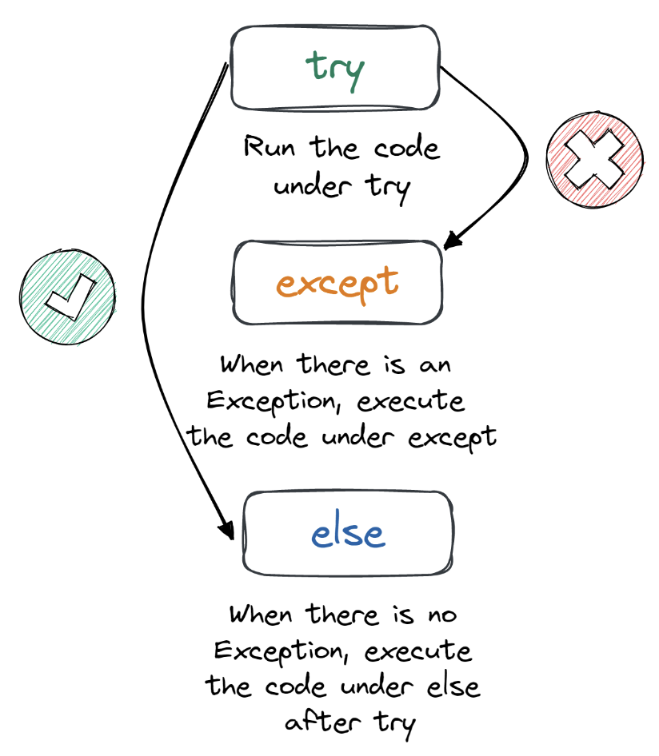

### Built-in Python Exceptions

Here is the list of default Python exceptions with descriptions:

1. AssertionError: raised when the assert statement fails.
2. EOFError: raised when the input() function meets the end-of-file condition.
3. AttributeError: raised when the attribute assignment or reference fails.
4. TabError: raised when the indentations consist of inconsistent tabs or spaces.
5. ImportError: raised when importing the module fails.
6. IndexError: occurs when the index of a sequence is out of range
7. KeyboardInterrupt: raised when the user inputs interrupt keys (Ctrl + C or Delete).
8. RuntimeError: occurs when an error does not fall into any category.
9. NameError: raised when a variable is not found in the local or global scope.
10. MemoryError: raised when programs run out of memory.
11. ValueError: occurs when the operation or function receives an argument with the right type but the wrong value.
12. ZeroDivisionError: raised when you divide a value or variable with zero.
13. SyntaxError: raised by the parser when the Python syntax is wrong.
14. IndentationError: occurs when there is a wrong indentation.
15. SystemError: raised when the interpreter detects an internal error.

---

### Multiple except statement example

In the example, we will be using multiple `except` statements for handling multiple types of exceptions.

If a ZeroDivisionError exception is raised, the program will print "You cannot divide a value with zero."
For the rest of the exceptions, it will print “Something else went wrong.”  
It allows us to write flexible code that can handle multiple exceptions at a time without breaking.

```
    try:
        print(1/0)
    except ZeroDivisionError:
        print("You cannot divide a value with zero")
    except:
        print("Something else went wrong")
```

---

### Loading the file example

Now, let’s look at a more practical example.

In the code below, we are reading the CSV file, and when it raises the FileNotFoundError exception, the code will print
the error and an additional message about the `data.csv` file.

Yes, we can print default error messages without breaking the execution.

```
    try:
       with open('data.csv') as file:
           read_data = file.read()
    except FileNotFoundError as fnf_error:
       print(fnf_error)
       print("Explanation: We cannot load the 'data.csv' file")
```

```
    [Errno 2] No such file or directory: 'data.csv'
    Explanation: We cannot load the 'data.csv' file
```

---

### Simple example for else

We are adding the `else` statement to the ZeroDivisionError example. As we can see, when there are no exceptions, the
print function under the `else` statement is executed, displaying the result.  


```
    try:
       result = 1/3
    except ZeroDivisionError as err:
       print(err)
    else:
       print(f"Your answer is {result}")
```

```
    Your answer is 0.3333333333333333
```

---

### finally Keyword in Python

The `finally` keyword in the try-except block is always executed, irrespective of whether there is an exception or not.
In simple words, the `finally` block of code is run after the try, except, the else block is final. It is quite useful
in cleaning up resources and closing the object, especially closing the files.


The `divide` function is created to handle ZeroDivisionError exceptions and display the result when there are no
exceptions. No matter what the outcome is, it will always run `finally` to print “Code by DataCamp” in green color.

```
    def divide(x,y):
        try:
            result = x/y
        except ZeroDivisionError:
            print("Please change 'y' argument to non-zero value")
        except:
            print("Something went wrong")
        else:
            print(f"Your answer is {result}")
        finally:
            print("\033[92m Code by DataCamp\033[00m")
```

Powered By
In the first test, we are dividing 1 by 0, which should raise the ZeroDivisionError exception and print the message. As
we can see, we have an additional line after the error message.

```
    divide(1,0)
```

```
    Please change 'y' argument to non-zero value
     Code by DataCamp
```

When we add valid input, it displays the result by executing `else` and `finally` blocking.

```
    divide(3,4)
```

```
    Your answer is 0.75
     Code by DataCamp
```

Powered By
Instead of an integer, we have added a string as a second argument which has raised an exception, which is different
from ZeroDivisionError, with a different message.

```
    divide(1,'g')
```

```
    Something went wrong
     Code by DataCamp
```

---